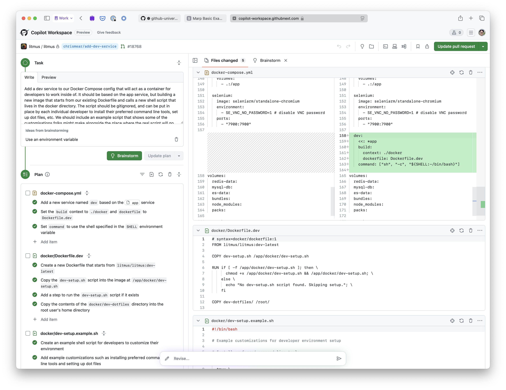

# GitHub Universe 2024
<!-- _color: white -->

---

# What did I learn

<!-- _color: white -->

1. Announcements about GitHub products
2. Tips and ideas we could use

---

# GitHub Announcements

<!-- _color: white -->

---

# Copilot multi-file editing and Copilot Workspace

* Two completely separate features for now

---

# Copilot multi-file editing

---

# Copilot Workspace

---

# Copilot upgrade assistant for Java

Not directly relevant to us, but imagine this applied to a Rails upgrade.

---

# Autofix and Security Campaigns

* Autofix has been available since August
* Security Campaigns is like project management around security issues
* Integrates with GitHub's own CodeQL and Dependabot, but also with third-party scanners.

---

# Tips and ideas we could use
<!-- _color: white -->

---

# GitHub Actions

---
# GitHub Actions

---
# GitHub Actions

---

# Figma and developers

---
# Figma and developers

---
# Figma and developers

---
# Figma and developers

---

# Requirements gathering

---
# Requirements gathering

---

# Addendum: Attend a conference!

---

# Recommended talks available online

* [Don't observe, debug: Discover how to quickly trace issues](https://www.youtube.com/watch?v=Vd0Rl-BeXkQ)
* [How the New York Times engineered a user-friendly developer platform](https://www.youtube.com/watch?v=UjDbVYLjMmA)
* [Thriving through change: A decade of engineering evolution at Spotify](https://www.youtube.com/watch?v=0oDH-0ulbMo)

---

# GitHub product announcements

* [Everything GitHub announced](https://github.blog/news-insights/product-news/universe-2024-previews-releases/)
  * [Copilot Workspace](https://github.blog/changelog/2024-10-29-refine-and-validate-code-review-suggestions-with-copilot-workspace-public-prev)
  * [Copilot Multi-file Editing](https://github.blog/changelog/2024-10-29-multi-file-editing-code-review-custom-instructions-and-more-for-github-copilot-in-vs-code-october-release-v0-22)
  * [Copilot code review](https://github.blog/changelog/2024-10-29-github-copilot-code-review-in-github-com-public-preview/)
  * [Security campaigns](https://docs.github.com/en/enterprise-cloud@latest/code-security/securing-your-organization/fixing-security-alerts-at-scale/about-security-campaigns)
